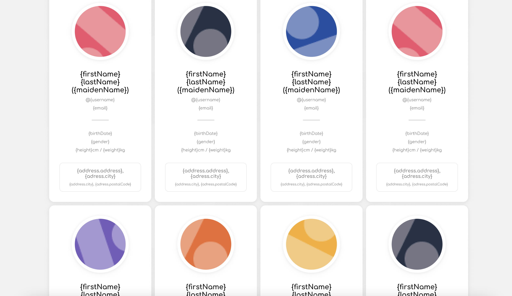

# Test technique Agile

Ce projet a été bootstrappé avec [Create React App](https://github.com/facebook/create-react-app).

## 1 - Présentation de l'application

L'objectif de cette application est de récupérer des informations sur des utilisateurs et de les présenter sous forme de liste selon le modèle suivant :

## 2 - Les technologies utilisées

  - React [documentation React](https://fr.reactjs.org/docs/getting-started.html)
  - TypeScript [installer Typescript](https://www.typescriptlang.org/download)
  - Bootstrap [documentation bootstrap](https://getbootstrap.com/docs/5.2/getting-started/introduction/)

## 3 - Les commandes présentes dans le projet

Dans le dossier du projet, vous pouvez exécuter les commandes suivantes :

### `npm start`

Lance l'application en mode développement.
Ouvre [http://localhost:3000](http://localhost:3000) dans le navigateur.

La page se rechargera automatiquement si vous faites des modifications.

### `npm test`

Ouvre l'interface qui permet de lancer les tests.

Pour plus d'informations sur les tests : [running tests](https://facebook.github.io/create-react-app/docs/running-tests).

### `npm run build`

Build l'app pour la production dans un dossier build.
La commande build permet d'avoir un projet optimisé pour la production.

Votre application est prête à être déployée.

Plus d'informations : [deployment](https://facebook.github.io/create-react-app/docs/deployment).

## 4 - Pour en savoir plus

Vous pouvez en apprendre plus sur [Create React App](https://facebook.github.io/create-react-app/docs/getting-started).

Pour apprendre React, lire la [documentation React](https://reactjs.org/).
